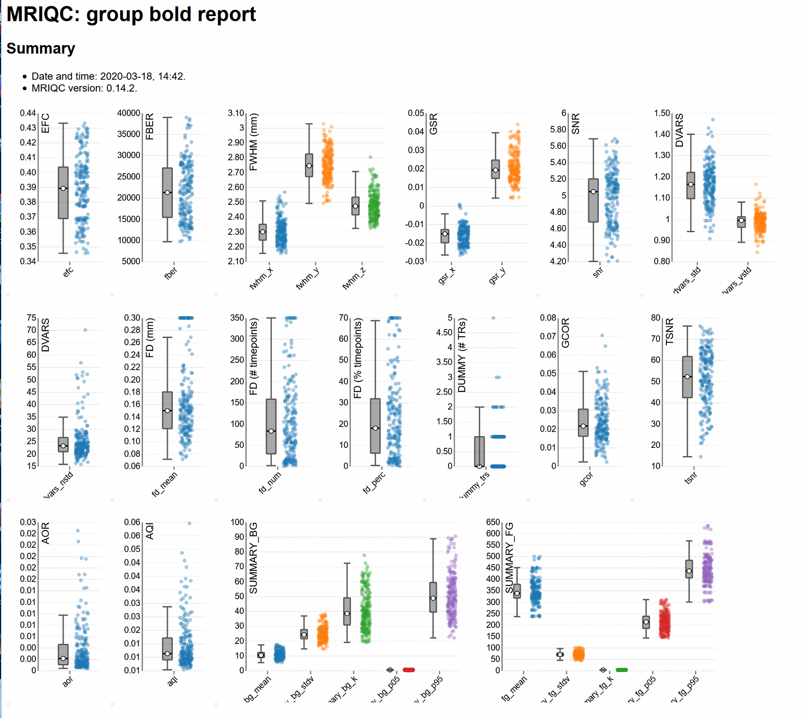

# Preamble. MRIQC output visualization

## Full details

* MRIQC is a standardized MRI image quality assessment tool
    * <a href="https://mriqc.readthedocs.io/en/latest/about.html">Documentation</a>
    * <a href="https://journals.plos.org/plosone/article?id=10.1371/journal.pone.0184661">Paper</a>

## Group-Level Reports



## Critical Image Quality Metrics (IQMs) for BOLD act & conn analyses:

* Temporal signal-to-noise ratio (tSNR):
    * $tSNR$ $=$ $\frac{\langle S \rangle_t}{\sigma_t}$
    * Ratio of the mean BOLD signal (across time) and temporal standard deviation.
    * Higher numbers = Better.
* Framewise Displacement (FD):
    * $FD_𝑡$ $=$ $|\Delta d_x,t|$ + $|\Delta d_y,t|$ + $|\Delta d_z,t|$ + $|\Delta \alpha_t|$ + $|\Delta \beta_t|$ + $|\Delta \gamma_t|$ 
    * Instantaneous head motion.
    * Higher numbers = Worse.    
* Effect of low tSNR and high FD:
    * Harder to detect task activations.
    * Introduce spurious changes in functional connectivity.

## Assignment 4: 

1. Read in an MRIQC group report.
    * Already completed this step in the starter code. 
    * Dataset contains 4 task fMRI runs and 1 resting-state fMRI run / subject.
2. Make a scatterbox plot of tSNR.
3. Group the tSNR scatterbox to see if motion varies as a function of...
    1. Task (resting-state vs. task fMRI runs)
    2. Timing (early vs. later fMRI runs)
4. Plot the relationship between tSNR and mean FD, grouped by task.
5. Reproduce #4 with pid labels.
    1. Which 2 participants probably have terrible resting-state data?
    
## Code chunk for item #1:
* Load tidyverse
* Set up some themes / palettes you can use if you want
* Load data & mutate vars needed for assignment

```{r setup}
### load tidyverse
library(tidyverse)

### Custom palette & theme
# Many palettes available online, can customize
# these are from: https://colorbrewer2.org/#type=qualitative&scheme=Set1&n=9
dspn_palette <- c("#377eb8","#e41a1c","#4daf4a","#984ea3","#ff7f00")
# This is the basic function I use for all the ggplots I create. 
# Modified from this black themed ggplot function: https://gist.github.com/jslefche/eff85ef06b4705e6efbc
dspn_theme = function(base_size = 24, base_family = "") {
  
  theme_grey(base_size = base_size, base_family = base_family) %+replace%
    
    theme(
      # Specify axis options
      axis.line = element_blank(),  
      axis.text.x = element_text(size = base_size*0.8, color = "black", lineheight = 0.9),  
      axis.text.y = element_text(size = base_size*0.8, color = "black", lineheight = 0.9),  
      axis.ticks = element_line(color = "black", size  =  0.2),
      axis.title.x = element_text(size = base_size, color = "black", margin = margin(10, 0, 0, 0)),
      axis.title.y = element_text(size = base_size, color = "black", angle = 90, margin = margin(0, 10, 0, 0)),  
      axis.ticks.length = unit(0.3, "lines"),   
      # Specify legend options
      legend.background = element_rect(color = NA, fill = "#ffffff"),  
      legend.key = element_rect(color = "black",  fill = "#ffffff"),  
      legend.key.size = unit(2, "lines"),  
      legend.key.height = NULL,  
      legend.key.width = NULL,      
      legend.text = element_text(size = base_size*0.8, color = "black"),  
      legend.title = element_text(size = base_size*0.8, face = "bold", hjust = 0, color = "black"),
      legend.position = "right",  
      legend.text.align = NULL,  
      legend.title.align = NULL,  
      legend.direction = "vertical",  
      legend.box = NULL, 
      # Specify panel options
      panel.background = element_rect(fill = "#ffffff", color  =  NA),  
      panel.border = element_rect(fill = NA, color = "black"),  
      panel.grid.major = element_line(color = "#ffffff"),  
      panel.grid.minor = element_line(color = "#ffffff"),  
      panel.spacing = unit(2, "lines"),
      # Specify facetting options
      strip.background = element_rect(fill = "grey30", color = "grey10"),  
      strip.text.x = element_text(size = base_size*0.8, color = "black"),  
      strip.text.y = element_text(size = base_size*0.8, color = "black",angle = -90),  
      # Specify plot options
      plot.background = element_rect(color = "#ffffff", fill = "#ffffff"),  
      plot.title = element_text(size = base_size*1.2, color = "black"),  
      plot.margin = unit(rep(1, 4), "lines")
    ) 
}

### Loading data + mutating to create task and timing vars

# loading the data
file <- '../data/group_bold.txt'
df <- read_tsv(file)

# setting up new vars
# Coding some new variables
# 1. Participant ID
# 2. Task (rest, or doing a task)
# 3. Timing (first two runs = early, second two runs+rest = late)
df <- df %>% 
    mutate(pid = str_sub(bids_name,1,3),
          task = ifelse(grepl('run',bids_name),'task','rest'),
          timing = ifelse((grepl('run-1',bids_name) | grepl('run-2',bids_name)),'early','late'))
```

## Code chunk for item #2:
* Scatterbox of tSNR

```{r item2}

#### code for item 2 ####

```

## Code chunk for item #3:
* Grouped scatterbox of tSNR by...
    * Task
    * Timing

```{r item3}

#### code for item 3 ####

```

## Code chunk for item #4:
* Plot of the association between tSNR and FD, grouped by...
    * Task

```{r item_4}

#### code for item 4 ####

```

## Code chunk for item #5:

* Plot from previous chunk, but with participant ID labels
    * Which two participants are likely to have sub-par resting-state data?

```{r item5}

#### code for item 5 ####

```
